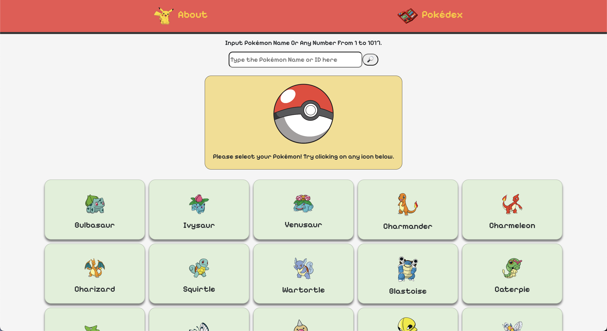
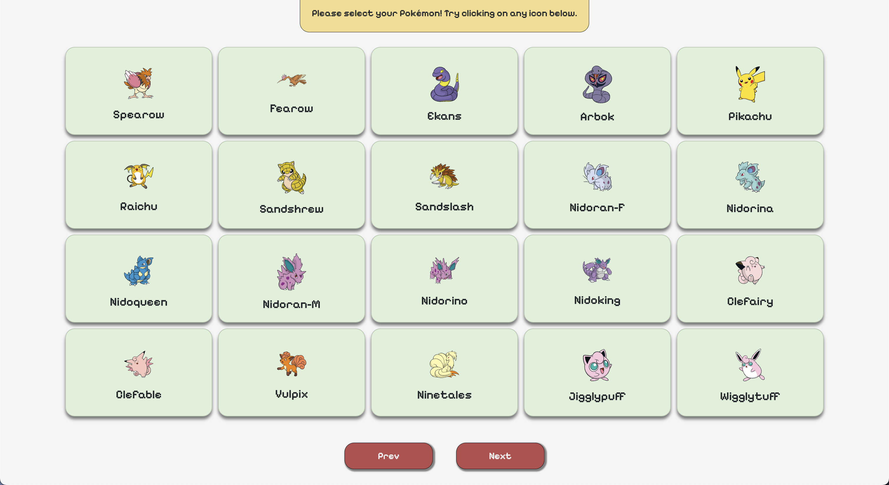
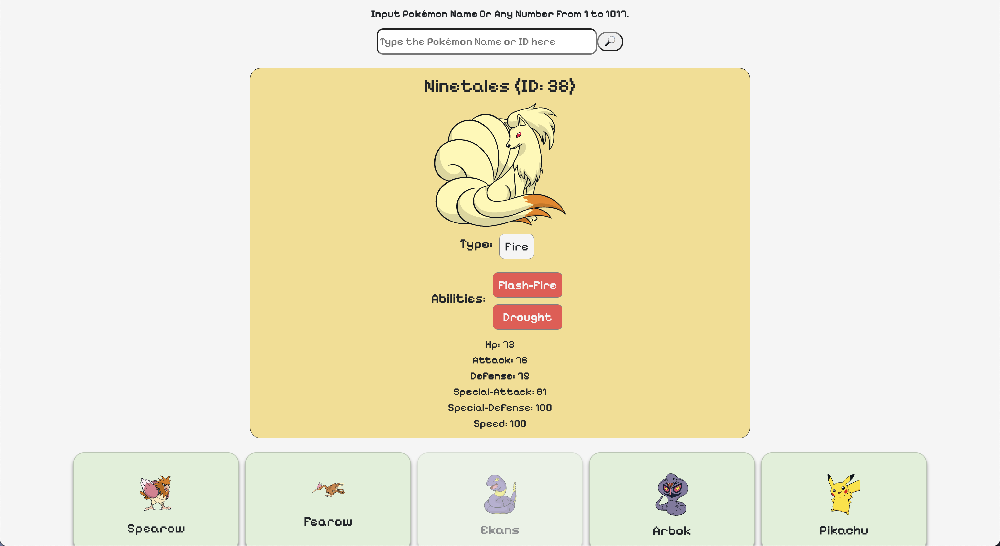
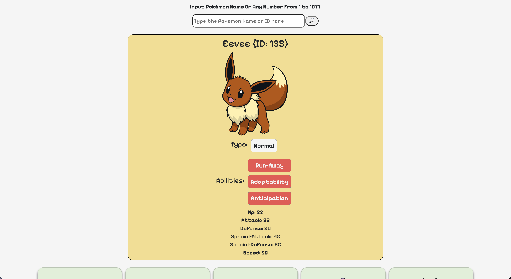
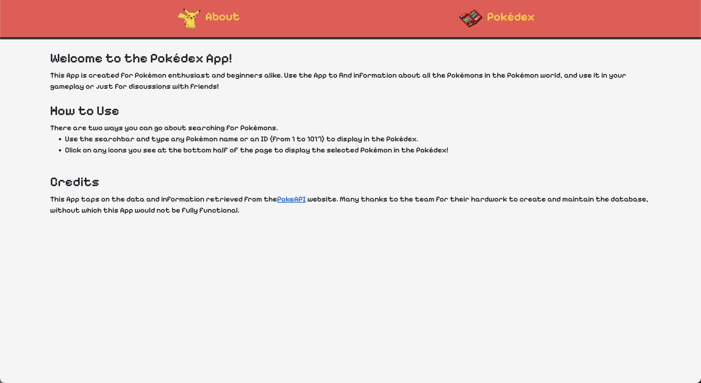

# Project-2_Pokemon-App
This App is essentially a "Pokédex", which by strict definition refers to:
> ["An electronic device designed to catalogue and provide information regarding the various species of Pokémon featured in the Pokémon video game, anime and manga series."](https://poke-pikachu.fandom.com/wiki/Pok%C3%A9dex)

To use the Pokédex, the user have to simply input any number from 1 to 1017 to search for any Pokémon. Alternatively, if the user knows the Pokémon name, they can input into the search bar as well. Doing so will generate the information of Pokémon.

The user can also choose to click on the cards at the bottom of the App to select a Pokémon, and doing so will likewise display the Pokémon information. The cards at the bottom can be scrolled, displaying 20 Pokémons in one page. 

## Technologies Used
- React
- JavaScript
- HTML
- CSS
- Bootstrap

## App Enhancement Roadmap
Further down the line, updates would be rendered to improved the App. The possible updates include, but does not restricted to, the following listed below:
- Favourite button to be included in the section which displays the selected Pokémon. This would then be rendered in a page where users would be able to view all favourites Pokémon all at once.
- Improvement to the UI of the App, specifically a dynamic background which changes accent colours depending on the Pokémon's colour. The Pokémon type component will also be improved to render a colour and symbol for easier identification of Pokémon type.
- Drawing on more information from the API to increase the information rendered to user for a selected Pokémon i.e. Pokémon's evolution path, Pokémon's habitat in different maps on the game.
- A comparison function to compare 2 or more Pokémons side by side.
- Update images of all Pokémons.

## Screenshots of the App

## Credit
This App was made possible by the efforts of the PokeAPI team, who are constantly improving and maintaining the API. 
Also special thanks to my instructor, Desmond, and coursemate, Wen Song, for the help to clarify doubts during this journey, for without which I would not have been able to create the first version of this App. 
